I keep production boring. The highest compliment infrastructure can earn is that nobody
thinks about it: you make a change, the obvious thing happens, and everyone moves on.
Five years of doing that across streaming and iGaming at scale — pipelines, clusters,
the edge, observability, and the pager.



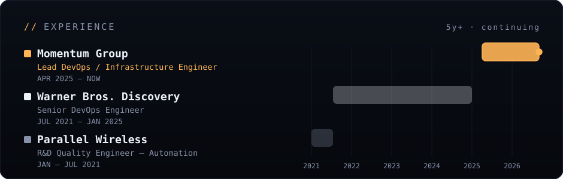

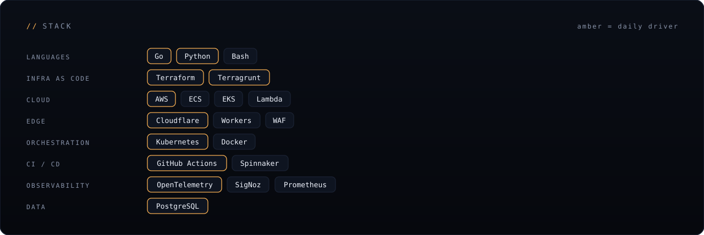

<table width="100%">
<tr>
<td width="50%"><a href="https://github.com/hisourav4u/ship">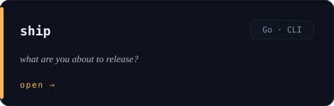</a></td>
<td width="50%"><a href="https://github.com/hisourav4u/blastradius">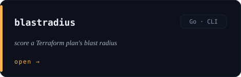</a></td>
</tr>
<tr>
<td><a href="https://github.com/hisourav4u/freeze">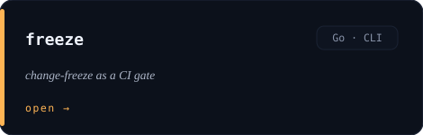</a></td>
<td><a href="https://github.com/hisourav4u/kubectl-blastradius">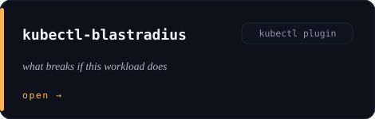</a></td>
</tr>
<tr>
<td><a href="https://github.com/hisourav4u/budget">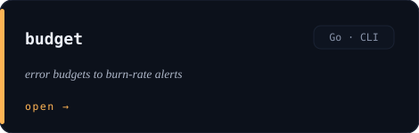</a></td>
<td><a href="https://github.com/hisourav4u/idle">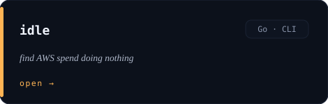</a></td>
</tr>
<tr>
<td><a href="https://github.com/hisourav4u/runbook">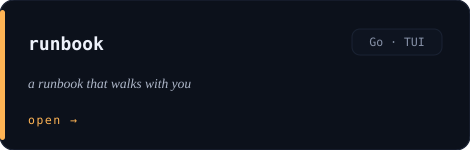</a></td>
<td><a href="https://github.com/hisourav4u/oncall">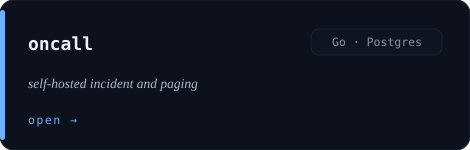</a></td>
</tr>
<tr>
<td><a href="https://github.com/hisourav4u/oncall-escalator">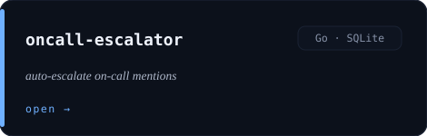</a></td>
<td width="50%"></td>
</tr>
</table>

<table width="100%">
<tr>
<td width="50%"><a href="https://github.com/hisourav4u/Minutes">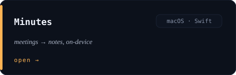</a></td>
<td width="50%"><a href="https://github.com/hisourav4u/Bulwark">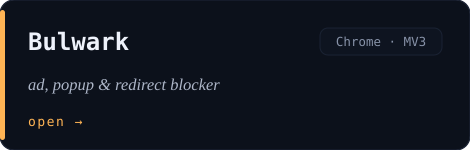</a></td>
</tr>
<tr>
<td><a href="https://github.com/hisourav4u/ClipboardManager">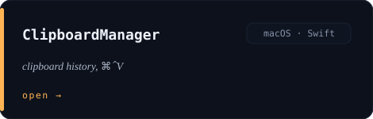</a></td>
<td><a href="https://github.com/hisourav4u/BlobTodo">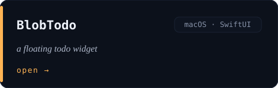</a></td>
</tr>
<tr>
<td><a href="https://github.com/hisourav4u/MeetingReminder">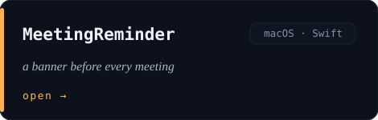</a></td>
<td><a href="https://github.com/hisourav4u/TabDeck">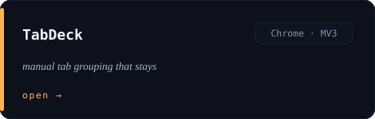</a></td>
</tr>
<tr>
<td><a href="https://github.com/hisourav4u/SolarSystem">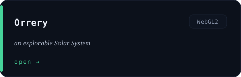</a></td>
<td><a href="https://github.com/hisourav4u/HumanAnatomy">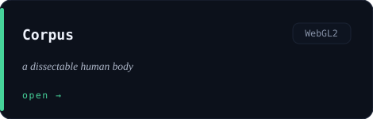</a></td>
</tr>
<tr>
<td><a href="https://github.com/hisourav4u/CPUAnatomy">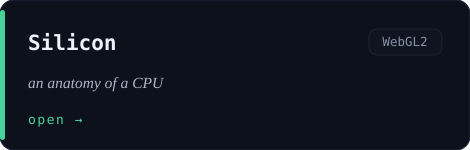</a></td>
<td><a href="https://github.com/hisourav4u/WinSim">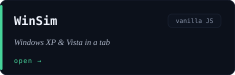</a></td>
</tr>
<tr>
<td><a href="https://github.com/hisourav4u/VoidGraze">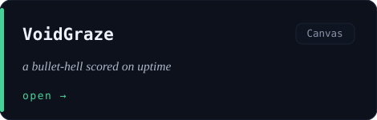</a></td>
<td><a href="https://github.com/hisourav4u/PassportSheet">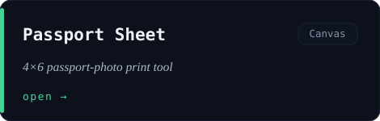</a></td>
</tr>
<tr>
<td><a href="https://github.com/hisourav4u/Freefall">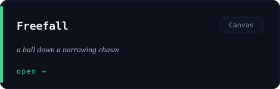</a></td>
<td><a href="https://github.com/hisourav4u/DeployTheTeam">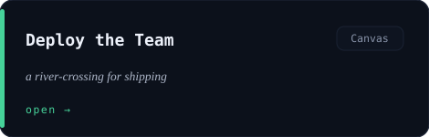</a></td>
</tr>
</table>

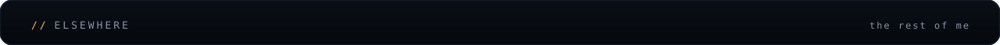

<table width="100%">
<tr>
<td width="33.3%"><a href="https://souravkundu.dev">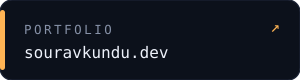</a></td>
<td width="33.3%"><a href="https://souravkundu.dev/labs">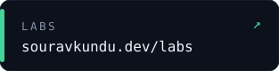</a></td>
<td width="33.3%"><a href="https://linkedin.com/in/souravkundu1998">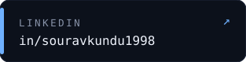</a></td>
</tr>
</table>

Every panel and card on this page is a single self-contained SVG — no third-party services, no trackers, no fetched fonts — generated by the scripts in <a href="./tools"><code>tools/</code></a>. Same ethos as the labs: the page asks the network for nothing.
